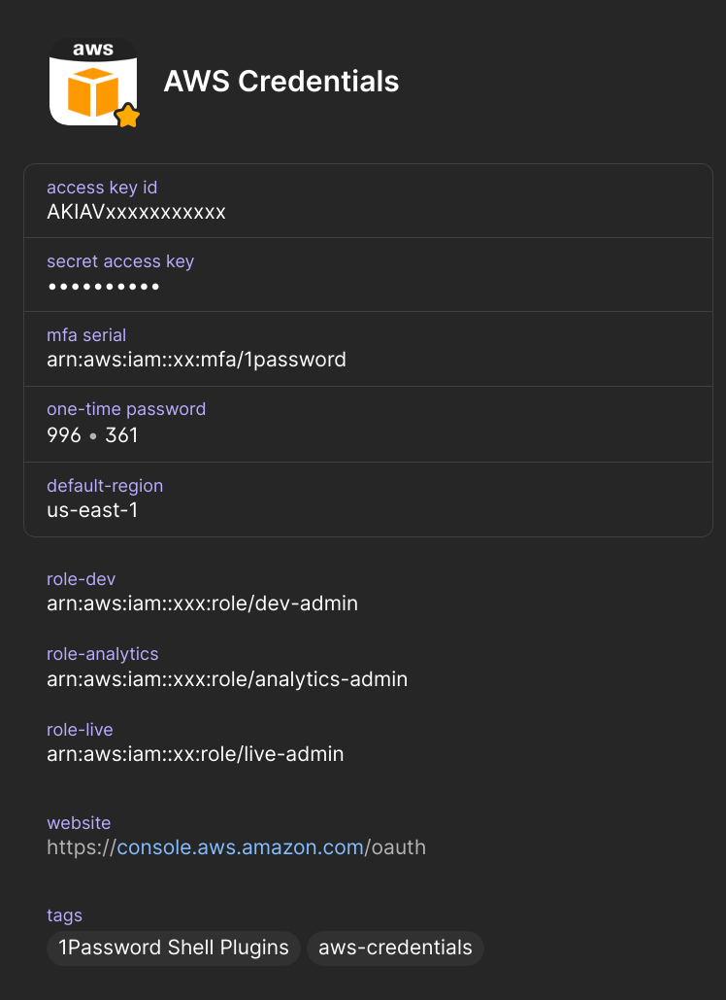

# op-aws-vault 🚀

A handy `aws-vault`-like utility built entirely on 1Password!

## 🤔 What is it?

Ever wished `aws-vault` played nicely with 1Password? Or found the official 1Password AWS plugin a little... quirky? This tool scratches that itch! ✨

It's a small Python script that mimics `aws-vault`'s core behavior but integrates seamlessly with your 1Password vault. It leverages the power of the 1Password CLI (`op`).

**Prerequisites:**
*   A 1Password account
*   The 1Password CLI (`op`) installed and configured
*   The 1Password desktop app running and unlocked

Tested and working on macOS, Linux, Windows, and WSL2! ✅

**Core Features:**
*   🔑 Execute commands or open a shell with temporary AWS credentials (including MFA support!) for any role you can assume.
*   🌐 Log in to the AWS Management Console via federation with a single command.

No more juggling configuration files! All settings – AWS credentials, OTP secrets, and assumable roles – live securely within your 1Password vault. Set it up once, use it everywhere! 🌍

## 🛠️ How to install

1.  Create a Python Virtual Environment (recommended):
    ```bash
    python -m venv .venv
    source .venv/bin/activate # On Linux/macOS
    # .\.venv\Scripts\activate # On Windows
    ```
2.  Install using pip:
    ```bash
    pip install op-aws-vault
    ```

**Tip:** You might want to disable the 1Password AWS integration (`unalias aws` in your shell profile if needed) to avoid potential conflicts.

## ⚙️ Setup in 1Password

Create a new **Login** item (or use an existing one) in 1Password and add the following fields with these exact labels:

*   `access key id` (Your AWS Access Key ID)
*   `secret access key` (Your AWS Secret Access Key)
*   `mfa serial` (Your MFA device ARN, e.g., `arn:aws:iam::123456789012:mfa/YourUser`. Recommended!)
*   `one-time password` (Link this to the TOTP secret for your MFA device)
*   `default-region` (e.g., `us-east-1`, `eu-west-1`)
*   `session name` (Optional: A custom name for the AWS session. Defaults to `op-aws-vault` if omitted)

**Adding Assumable Roles:**

For each AWS role you want to assume, add a **Text** field with the label following the pattern `role-{your-role-name}`. The value should be the full ARN of the role.

*Example:*
*   Label: `role-developer`
*   Value: `arn:aws:iam::987654321098:role/DeveloperRole`

Add as many roles as you need!

**Tagging:**

Finally, add the tag `aws-credentials` to this 1Password item. This is how `op-aws-vault` finds your configuration.

Your item should look something like this:



## 🚀 Usage

All commands require the `role` name as the first argument. This can be:
*   The name you defined after `role-` (e.g., `developer` from the example above).
*   `default` to use the base credentials directly (MFA will still be used if configured).

Expect 1Password to prompt for authentication periodically.

**Common Optional Arguments:**

*   `--region <aws-region>`: Specify the AWS region for the command (overrides `default-region`).
*   `--duration <duration>`: Set the session validity period (e.g., `15m`, `1h`, `8h`). Defaults to `1h`.

---

### `op-aws-vault exec` 💻

Opens an authenticated shell or runs a command with the specified role's credentials.

**Examples:**

*   Open your default shell with the `developer` role credentials:
    ```bash
    op-aws-vault exec developer
    ```
*   Run a specific command (`aws s3 ls`) with the `developer` role:
    ```bash
    op-aws-vault exec developer -- aws s3 ls
    ```
*   Open a specific shell (`/bin/bash`) with the `default` credentials:
    ```bash
    op-aws-vault exec default -- /bin/bash
    ```

Unlike the original `aws-vault`, `op-aws-vault` sessions can be safely nested if needed.

---

### `op-aws-vault login` 🌐

Generates a federated login URL for the AWS Management Console and opens it in your default web browser.

**Example:**

*   Log in to the console as the `developer` role:
    ```bash
    op-aws-vault login developer
    ```

**Get URL Only:**

If you prefer to copy the URL instead of opening a browser, use the `--stdout` flag:
```bash
op-aws-vault login developer --stdout
```

---
Happy vaulting! 🎉
